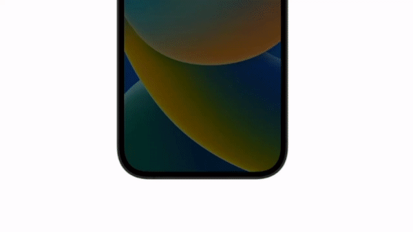

# SubMe - Your Subscription Manager

SubMe is an iOS application that helps you to manage all your subscriptions in one place.

---

# Virtual cards

Create and design your own virtual cards for your subscriptions. For every subscription you can add virtual card that is connected to your SubMe account.

You can easly setup your subscription payment by selecting One-time payment or Recurring payment.

---

# Easy to use

Easly add your existing subscriptions to track in app. You will be asked to add subscription name, price, currency, billing cycle and billing date.

If you add popular subscription like Netflix, Spotify or Apple Music, SubMe will automatically add subscription icon and color.

---

# Notifications

SubMe will notify you when your subscription is about to renew. You can set up notification time in app settings.

---

# Statistics, statistics, statistics!

SubMe will show you how much you spend on your subscriptions. You can see your monthly, yearly and all time spendings. You can see easly how much you spend on every subscription and save money by deleting subscriptions you don't need!

In chart view you can see how much you spend on every subscription and how much you spend on every category.

# Family sharing

SubMe supports family sharing. You can add your family members to your SubMe account and share your subscriptions with them with just couple of clicks.

# Light mode and Dark mode

SubMe supports both light and dark mode for the best user experience.

_SubMe is concept project and is not available on the App Store. Features like virtual card are only for demonstration and does not work in app_
